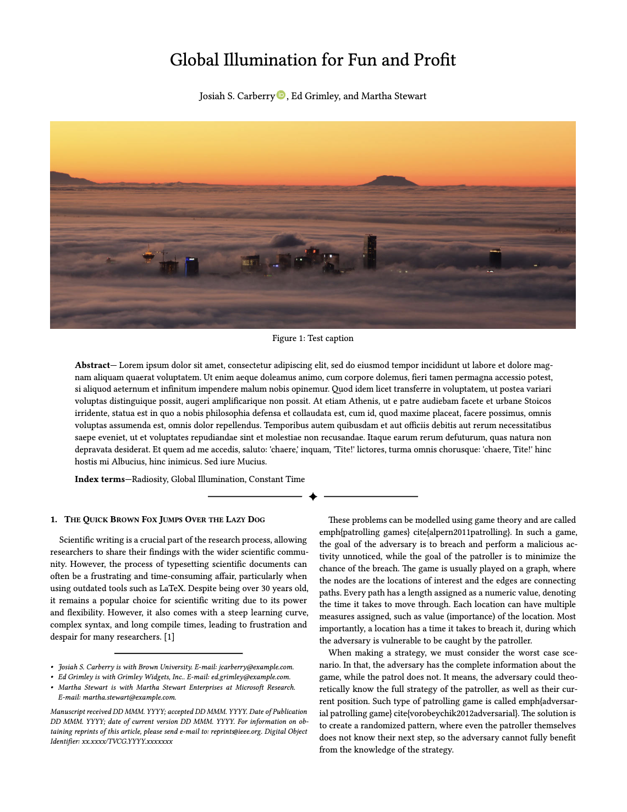

# tvcg-journal-typst

A [Typst](https://typst.app) template for TVCG journals and the IEEE VIS Conference. We aim to closely mirror the [LaTeX template](https://github.com/ieeevgtc/tvcg-journal-latex).

## Previews

<p align="center"></p>

Live [preview of the PDF template](https://domoritz.github.io/tvcg-journal-typst/main.pdf).

## Development

First, link the current directory as a [Typst local package](https://github.com/typst/packages#local-packages) so that the template can be used in a local project.

- **Mac and Linux:** use `link.sh`.
- **Windows:** use `link.ps1`. Make sure you have the *Developer mode* in Windows set up, otherwise the symlink won't work.

Then run `typst compile template/main.typ --root template/` to compile the template against the development version of the package. If you want to use the released version of the tvcg-journal package, delete the local symlink.

### Fonts

**Mac and Linux:** Install the required fonts locally with `brew install font-liberation`.

**Windows:** Install the fonts `Liberation Serif` and `Liberation Sans`. you can download them from [here](https://github.com/liberationfonts/liberation-fonts).

### Creating a Thumbnail

```bash
typst compile -f png --pages 1 --ppi 250 template/main.typ --root template/ thumbnail.png
oxipng -o 4 --strip safe --alpha thumbnail.png
```

You are encouraged to use [oxipng](https://github.com/oxipng/oxipng) to reduce the thumbnail's file size.

### Check the package

Run `typst-package-check check` with [typst-package-check](https://github.com/typst/package-check).
